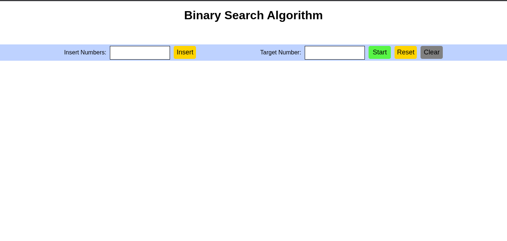

# 🔍 Binary Search Algorithm Visualization with React.js

This project is a **school activity** designed to demonstrate the working of the **Binary Search Algorithm** through a clean and interactive animation built using **React.js**.

## 📚 About the Project

The Binary Search algorithm is one of the most efficient techniques for searching an element in a sorted array. This project visualizes how binary search works internally by breaking down each step with smooth animations and clear UI indicators.

Whether you're a student, an aspiring developer, or just curious about algorithms, this visualization offers an intuitive way to understand the divide-and-conquer approach of binary search.

## 🚀 Features

- ✅ Animated step-by-step visualization of the binary search process  
- ✅ Visual indicators for low, high, and mid pointers  
- ✅ User input to test custom arrays and target values   
- ✅ Built using **React.js** with functional components and hooks  

## 🛠️ Tech Stack

- **React.js**
- **JavaScript (ES6+)**
- **CSS3 / Styled Components**
- **Vite / Create React App** *(depending on setup)*

## 🎓 Purpose

This project was created as part of a **school activity** to enhance understanding of core algorithmic concepts through visualization. It also serves as a practical exercise in using modern front-end tools like React.

## 📸 Demo

[                                             ](https://drive.google.com/file/d/1spmRoWuP2G5F3wGud2XVf29VOlLbixnr/view?usp=sharing)


## 📦 Installation & Usage

```bash
# Clone the repository
git clone https://github.com/Harey112/binary-search-algo.git

# Navigate to the project directory
cd binary-search-algo

# Install dependencies
npm install

# Start the development server
npm start


